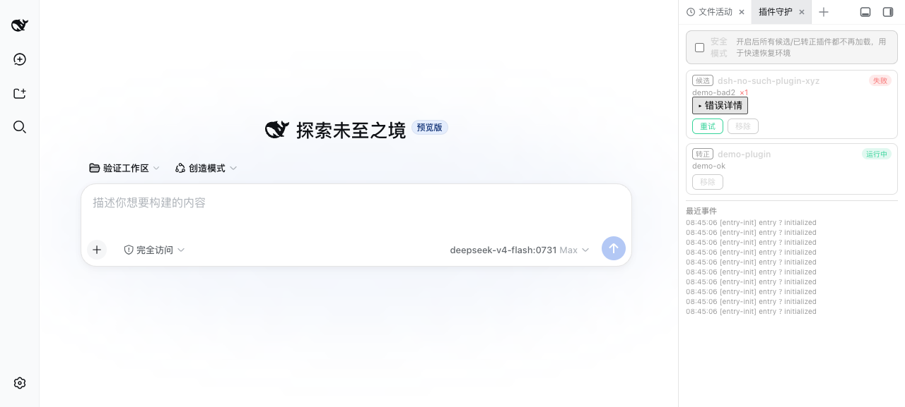
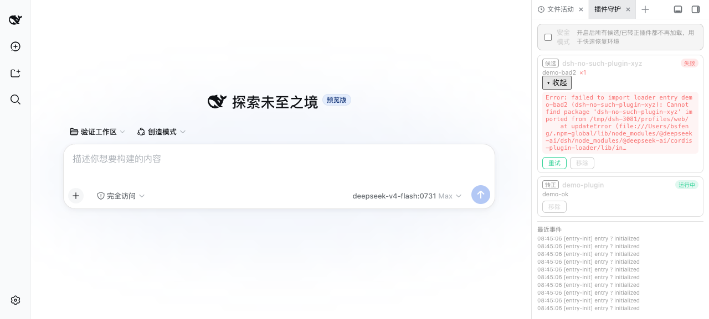

# 插件治理（dsh-my-guardian）

> ⚠️ **何时阅读：** 安装第三方/自研插件经常导致 DSH 启动失败时，或修改本插件代码前。

## 功能一句话

**新装/刚更新的插件先进"候选区"，由守护插件在 DSH 启动完成后逐个热挂载：成功自动转正，失败自动禁用并记录，配套侧边栏诊断面板与安全模式。** 核心启动区只保留稳定插件，把"坏插件拖垮整个 DSH"的概率降到最低。

## 解决的问题

DSH（Cordis）插件加载是 all-or-nothing：启动时任何插件 import 失败 / apply 抛错 / 依赖缺失都会让整个 `dsh web` 起不来（fail-loud 退出）。本插件利用 loader 运行时动态挂载 API（失败可 catch、可回滚），把新插件延迟到启动后加载，实现业界通行的"隔离 + 兜底"：

- **两段式加载**（借鉴 VS Code 懒激活 / systemd 分级启动）
- **失败自动禁用**（借鉴 VS Code 提示禁用问题扩展 / systemd 失败计数）
- **安全模式**（借鉴 VS Code `--disable-extensions` / IDE 安全模式）
- **诊断面板**（插件状态一览，人工处置入口）

## 工作机制

```
cordis.patch.yml（核心区，启动时加载，守护插件自身）
        ↓ 新插件写进
cordis.staged.json（候选区）
        ↓ DSH 启动完成后
守护插件逐个 tree.create() 动态加载
        ├─ 成功 → 自动转正（移出候选区，进入 guardian 持久化清单，每次启动自动恢复）
        └─ 失败 → 自动隔离（disabled 记录 + 失败次数 + 事件日志）
              └─ 连续失败 3 次 → 冻结（需手动解除）
```

## 业务场景映射

| 业务关键词 | 入口与方法（源码路径） |
|-----------|----------------------|
| 候选插件加载 / 失败自动禁用 / 转正 | `plugins/dsh-my-guardian/lib/index.js`（server）— `apply()` 内 `scanStaged()` / `mountWithState()` / `processStagedEntry()` |
| 安全模式 | `plugins/dsh-my-guardian/lib/index.js` — `state.safeMode` 读取与生效（挂载跳过 + 卸载已挂载） |
| 诊断面板 / 状态列表 / 重试 | `plugins/dsh-my-guardian/lib/client.js`（client）— 侧边栏页签 + `/guardian/api/*` |
| 状态文件 | `$DSH_HOME/guardian/state.json`（原子写，损坏降级） |

## 安装与使用

1. 仓库根 `pnpm install`
2. 在 `~/.dsh/profiles/<name>/cordis.patch.yml` 的 insert 列表**第一行**加：
   ```yaml
   - id: guardian
     name: 'dsh-my-guardian'
   ```
3. 新建候选文件 `~/.dsh/profiles/<name>/cordis.staged.json`，把新插件写进去（顶层数组 `{id, name, config}`）
4. 硬刷新浏览器 → 侧边栏出现"插件守护"页签

## 效果预览（真实 DSH 实例截图）





> 截图来自隔离 DSH 验证实例（3081 端口），完整说明见 [dsh-my-guardian README](../../plugins/dsh-my-guardian/README.md)。

## 依赖

- DSH web profile；可选 `dsh-better-sidebar`（诊断面板）、`dsh-my-notify`（失败通知）

## 自身可靠性（看门狗自保）

守护插件自己必须先活着，否则一切治理都是空谈。为此：

- **apply 永不抛错**：最外层 try/catch 兜底，任何同步错误只降级（不治理）不崩溃（fail-loud 会 exit(1) 拖垮整个 `dsh web`）。
- **异步全路径 catch**：扫描/挂载/持久化/事件回调全部捕获，无 unhandledRejection。
- **API 延迟注册**：`webServer` 服务可能晚于守护插件挂载（loader 行并发激活），API 注册改为轮询补注册，不因时序竞态永久缺失（真实环境验证发现并修复）。
- **状态文件损坏降级**：`state.json` / `cordis.staged.json` 损坏时降级为空状态，不影响启动。
- **无第三方运行时依赖**：只用 Node 内置模块 + loader 公开 API，代码极薄。
- **自身出问题的恢复手段**：从 `cordis.patch.yml` 删掉 guardian 行即可恢复（候选插件本来就没激活，无残留）。

## 边界（重要）

- 进程级隔离需要 DSH 框架支持（worker/子进程 + RPC），本插件提供的是**加载时序与失败处置**的兜底隔离，不是资源隔离。
- 正式核心区（`cordis.patch.yml`）里的插件仍遵循启动 all-or-nothing；请把一切新插件先放入候选区验证。

## 框架演进方向（远期，非本插件范围）

给 DSH 核心（`@deepseek-ai/dsh-app-boot` / `@deepseek-ai/cordis-plugin-loader`）的建议，供未来改进：

1. **启动失败不阻断**：将 `assertEntriesActivated` / fail-loud 改为"失败条目自动禁用并继续启动"（VS Code 式），坏插件只影响自己，不再拖垮整个 `dsh web`。
2. **进程级隔离**：server 插件跑在 worker_threads / 子进程中，通过 RPC 通信（借鉴 VS Code Extension Host）；client 插件同理（iframe / 独立 bundle 边界）。
3. **失败计数与分级启动**：loader 内置"连续失败 N 次自动禁用 + 启动分级"能力，替代本插件的用户态实现。

## 相关文档
→ [需求清单](需求清单.md) · [索引.md](../索引.md)
