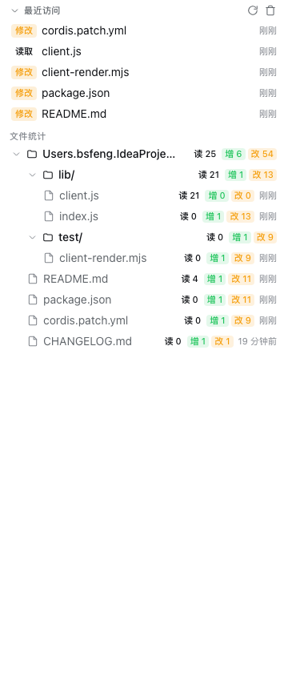

# dsh-file-activity

[](https://github.com/topics/dsh-better-sidebar)

<div align="center">
  
</div>

**DSH 侧边栏文件活动插件**（基于 [dsh-better-sidebar](https://github.com/omdsh-dev/DSH-better-sidebar) 扩展）

在 better-sidebar 中新增「文件活动」页签，提供：

- **最近访问**：按时间倒序记录文件读取 / 新增 / 修改事件（agent 工具读写 + 侧边栏打开/编辑保存都会记录），**最多保留最近 10 条**，点击任意文件即用侧边栏**原生预览能力**打开（图片 / PDF / HTML / 代码 / Markdown 等内置 viewer 自动匹配）。
- **文件统计**：每个文件的「读取 / 新增 / 修改」次数——工作区根目录（cwd）下的文件**直接平铺展示**，子目录文件**按文件夹平铺**（多层文件夹以 `.` 拼接展示，如 `src.components.ui`，文件缩进列在下方）；每个文件行内显示**最近访问时间**（相对时间），悬停可查看**创建时间**：

  ```
  README.md          ← 工作区根目录下的文件直接展示
  .gitignore
  docs.guide
    quickstart.md
  src.components.ui
    Button.tsx
  ```

- **默认启用**：页签注册后默认开启（无需在设置页勾选），且每个会话首次打开时**自动打开**本页（可在侧边栏设置中关闭自动打开）。

## 工作原理

- **Server 端**（`lib/index.js`）：监听 DSH `fs/observed` 事件捕获 agent 的 `read` / `write` / `edit` / `str_replace_editor` / `read_image` 等文件操作；提供 `/file-activity/api` 路由（`stats` / `record` / `clear`）；状态按会话持久化到 `$DSH_HOME/file-activity.json`（防抖 + 原子写入）。
  - `write` 通过每会话的已知文件表自动区分**新增**（首次接触）与**修改**（再次写入）。
- **Client 端**（`lib/client.js`）：通过 `ctx.betterSidebar.registerTab` 注册页签；fetch 拦截捕获侧边栏自身操作（`/sidebar/api/fs.read`、`/sidebar/api/fs.write`、`/sidebar/file` 媒体预览）并上报 server；点击文件调用 `ctx.betterSidebar.openFile(scope, path)` 走内置 viewer 匹配（image/pdf/markdown/html/code…）。

## 安装

前置：已安装 `dsh-better-sidebar`（v0.12+，推荐 v0.14）。

```sh
# 方式一：dsh plugin（推荐）
dsh plugin --profile web add link:/Users/bsfeng/IdeaProjects/my-dsh-plugins/plugins/dsh-file-activity

# 方式二：手动
# 1) 在 ~/.dsh/profiles/web/package.json 的 dependencies 增加：
#    "dsh-file-activity": "link:/Users/bsfeng/IdeaProjects/my-dsh-plugins/plugins/dsh-file-activity"
# 2) 在 ~/.dsh/profiles/web 下执行 pnpm install
# 3) 在 ~/.dsh/profiles/web/cordis.patch.yml 增加：
#    - insert:
#        - id: file-activity
#          name: 'dsh-file-activity'
```

装完后**硬刷新浏览器**（Cmd/Ctrl+Shift+R）。

> 编辑 profile 的 `cordis.patch.yml` 会在运行中通过 Cordis HMR 热挂载 server 端，无需重启 `dsh web`；client 端在页面刷新后生效。

## 使用

- 侧边栏 `+` 菜单 → 文件活动（或会话开始自动打开）。
- 点击任意文件行 → 在侧边栏中打开该文件（图片/PDF/HTML/Markdown/代码等原生预览）。
- 顶部「刷新」手动重载，「清空」删除当前会话全部记录。

## 配置

「设置 → 侧边卡片 → 文件活动」卡片齿轮：`会话开始时自动打开`（默认开）。

## 数据说明

- 按会话（session）隔离存储；最近访问列表每会话最多保留最近 10 条，文件统计不受条数限制。
- agent 的 `bash`/`git` 等命令内部的文件触碰不在此跟踪范围（只跟踪 DSH 原生文件工具与侧边栏操作）。
