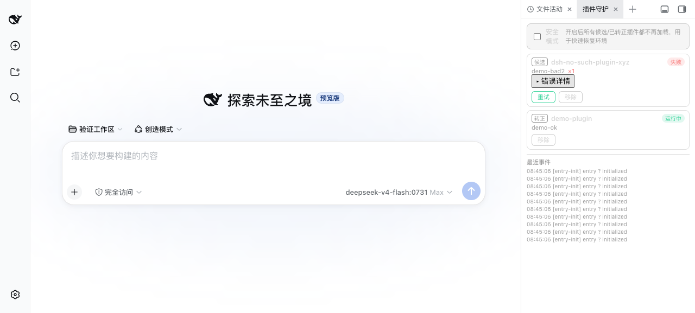
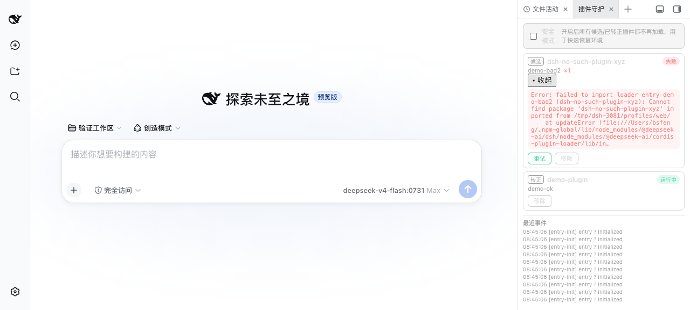

# dsh-guardian — 插件守护

> DSH（DeepSeek Harness）插件隔离与失败兜底：**新装/刚更新的插件先进候选区，由守护插件在启动完成后逐个热挂载——成功自动转正，失败自动隔离记录，连续失败冻结，一键安全模式**，配套侧边栏诊断面板。

## 为什么需要

DSH 的 Cordis 插件加载是 **all-or-nothing**：启动时任何插件 `import` 失败 / `apply` 抛错 / 依赖缺失，整个 `dsh web` 都会起不来（fail-loud 退出）。装一个新插件把环境搞坏，是插件用户最常踩的坑。

本插件借鉴 VS Code（Extension Host 崩溃自动重启 + 禁用问题扩展）、IntelliJ（Dynamic Plugins 运行时装卸）、systemd（失败计数超限即停）的思路，利用 DSH loader 的**运行时动态挂载 API**（失败可捕获、可回滚），把"新插件"从启动路径挪到启动之后：

```
cordis.patch.yml（核心区：只放稳定插件，守护插件自身）
        ↓ 新插件写进
cordis.staged.json（候选区）
        ↓ DSH 启动完成后
守护插件逐个热挂载
        ├─ 成功 → 自动转正（进入持久化清单，每次启动自动恢复）
        └─ 失败 → 自动隔离（记录次数+错误，连续 3 次冻结）
```

## 功能

- **两段式加载**：新装/更新插件先进候选区，启动不阻塞、坏插件不拖垮进程。
- **失败自动隔离**：挂载失败自动记录（尝试次数 + 错误摘要），连续失败 **3 次冻结**，需手动重试。
- **成功自动转正**：挂载成功的插件进入持久化清单（`$DSH_HOME/guardian/state.json`），后续每次启动自动恢复挂载。
- **安全模式**：一键跳过所有候选/已转正插件，快速恢复被插件搞坏的环境。
- **诊断面板**：dsh-better-sidebar 侧边栏"插件守护"页签——状态列表 / 重试 / 移除 / 错误详情 / 安全模式开关 / 最近事件。
- **运行中热挂载**：DSH 运行期间往候选区加条目，自动挂载，无需重启。

## 安装

### 方式一：dsh plugin（推荐）

```sh
# 1) 克隆本仓库（任意目录）
git clone https://github.com/baosfeng/my-dsh-plugins.git
# 2) 以本地 link 方式安装（将 <仓库路径> 替换为上面的克隆目录）
dsh plugin --profile web add link:<仓库路径>/plugins/dsh-guardian
```

装完**硬刷新浏览器**（Cmd/Ctrl+Shift+R）。

### 方式二：手动

1. 克隆本仓库后，在 `~/.dsh/profiles/web/package.json` 的 dependencies 增加 `"dsh-guardian": "link:<仓库路径>/plugins/dsh-guardian"`
2. `cd ~/.dsh/profiles/web && pnpm install`
3. 在 `~/.dsh/profiles/web/cordis.patch.yml` 的 insert 列表**第一行**加：

```yaml
- insert:
    - id: guardian
      name: 'dsh-guardian'
```

> ⚠️ **守护插件自身必须放在正式核心区第一行**（它自己是"看门狗"：启动时加载，随后才管理候选插件）。

## 使用

### 候选区文件

新建 `~/.dsh/profiles/web/cordis.staged.json`（与 `cordis.patch.yml` 同目录）：

```json
[
  { "id": "my-plugin", "name": "dsh-my-plugin", "config": { "option": 1 } }
]
```

- `id`：唯一标识（不能与现有插件行 id 冲突）
- `name`：插件包名（profile node_modules 中可解析）
- `config`：可选，插件的配置

写入文件后守护插件会自动挂载；挂载成功该条自动从候选文件移除（转正），失败则保留（状态记录在面板中可见）。

### 面板

侧边栏 → "插件守护"页签：

| 状态 | 含义 | 操作 |
|------|------|------|
| 运行中 | 已挂载 | 移除 |
| 待加载 | 尚未处理（安全模式等） | — |
| 失败 ×N | 挂载失败 N 次 | 重试 / 移除 |
| 冻结 | 连续失败 3 次 | 重试（解除冻结）/ 移除 |

### 效果截图（真实 DSH 实例验证）

侧边栏"插件守护"诊断面板（独立 3081 端口隔离 DSH 实例实测）：





> 截图环境：隔离 DSH 验证实例（`/tmp/dsh-3081`，端口 3081）。候选区同时写入 `demo-plugin`（挂载成功 → 自动转正"运行中"）与 `dsh-no-such-plugin-xyz`（包不存在 → 挂载失败自动隔离 ×1，错误详情保留可查）。

## 配置

- **状态文件**：`$DSH_HOME/guardian/state.json`（`~/.dsh/guardian/state.json`）——持久化候选/转正清单、失败次数、安全模式、事件日志。损坏自动降级为空状态，不影响启动。
- **安全模式**：面板开关（或直接编辑 `state.json` 的 `safeMode: true`）。开启后所有候选/已转正插件不再加载；恢复环境后关闭开关即重新加载。

## 诚实的边界

- 本插件提供的是**加载时序与失败处置的兜底隔离**，不是进程级资源隔离（server 端插件仍在同一 Node 进程，client 端仍在同一浏览器页面）。进程级隔离需要 DSH 框架支持 worker/子进程 + RPC（演进建议见 [docs/插件治理/概述.md](../docs/插件治理/概述.md)）。
- **启动阶段的正式核心区（`cordis.patch.yml`）仍遵循 all-or-nothing**。请把一切新插件先放入候选区验证，稳定后再考虑放核心区。

## 相关文档

→ [插件治理概述](../docs/插件治理/概述.md) · [需求清单](../docs/插件治理/需求清单.md)
