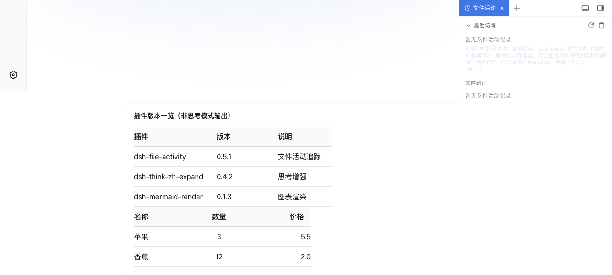

# dsh-md-render

[](https://github.com/topics/dsh)

<div align="center">
  <!-- 效果图占位：发版前替换为真实截图（非思考模式不标准表格渲染为表格） -->
  
</div>

**DSH 对话统一 Markdown 渲染插件**（issue #31 渲染职责迁移）：提供统一 **MarkdownView** 组件（表格 / 公式 / 代码块容器），承接 dsh-think-zh-expand 迁出的渲染职责；并在 DOM 层做**表格渲染增强**——非思考模式下模型输出的 markdown 表格，包括**无首尾管道符、分隔行变体**等不标准格式，自动识别并渲染为**真正的表格**（表头 / 边框 / 对齐），宽表格支持**横向滚动**。

## 功能

- **统一 MarkdownView**（供 dsh-think-zh-expand 跨插件调用）：代码块 / 标题 / 列表 / 引用 / 表格（含对齐）/ **公式** / 粗体 / 斜体 / 行内代码 / 链接；代码块保持 `div.md-code-block` 容器结构（dsh-mermaid-render 无需改动即可扫描）。
- **公式渲染**（自实现零依赖）：行内 `$...$` 渲染为公式样式（货币 `$5` / 变量 `a$b` / 块级 `$$` 保护），块级 `$$...$$` 渲染为居中公式块。
- **公式错误提示**：公式内容异常（未闭合 `$`、空公式、内容以空白开头、块级未闭合/空）时渲染为错误标记（`span.dmr-math-error` / `div.dmr-math-error`），显示原文 + 错误样式（DSH 语义 token `--dsw-alias-state-error-primary`），不破坏整体布局；货币 `$5` / 变量 `a$b` / 块级 `$$` 保护不误报。
- **不标准表格也能渲染**：增强表格检测——表头/数据行只需含 `|` 且 ≥2 列（允许无首尾管道符），分隔行支持 `--- | ---`、`-|-|-`、`---` 等变体；模型输出的"半成品"表格不再以纯文本段落展示。
- **对齐标记**：`:---` 左对齐、`:---:` 居中、`---:` 右对齐，逐列生效。
- **宽表格横向滚动**：表格外层 `div.dmr-table-scroll` 容器 `overflow-x: auto`，宽表格不撑破消息气泡。
- **表头 / 边框样式**：表头底色 + 加粗、行分隔线，样式走 DSH 语义 token（`--dsw-alias-*` / `--dsw-font-*`），深浅主题自适应。
- **兼容 dsh-think-zh-expand**：think-zh-expand 跨插件 require 本插件 MarkdownView（`dsh.client.external`）；识别其渲染器产出的 `div.tzx-md` 容器；已渲染的表格（`table.tzx-table`）不重复处理。
- **兼容内置 MarkdownText**：识别内置渲染器的 `div.md-table-wide` 宽表格容器，不干扰已渲染表格。
- **流式兼容**：MutationObserver 跟随消息流式渲染；流式中的容器（`[data-streaming]` 祖先）等内容稳定后再处理。
- **零依赖**：表格检测与渲染全部自实现，无第三方库、无 CDN。

## 工作原理

- **统一 MarkdownView**（`lib/parts/markdown.part.js`）：从 dsh-think-zh-expand 迁移的轻量 Markdown 渲染管线（`mdInline` + 块级 `tryXxx`），输出结构保持迁移前约定（`div.tzx-md` / `p.tzx-p` / `table.tzx-table` / `div.md-code-block`）；新增行内/块级公式渲染；`exports.MarkdownView` 供 think-zh-expand 跨 bundle require。
- **DOM 层表格增强**（`lib/parts/detect|render|scanner.part.js`）：扫描 `[data-conversation-scroll]` 内的 `div.tzx-md`（MarkdownView 输出）与 `div.md-table-wide`（内置 MarkdownText 的宽表格容器）容器；对容器内以纯文本段落（`p.tzx-p`）形式存在的表格文本，用增强检测规则解析（表头 + 分隔行 + 数据行 + 对齐），将段落替换为 `div.dmr-table-scroll > table.dmr-table`（thead/tbody/逐列对齐）；单元格内的 `**bold**` / `` `code` `` / `*em*` / `[link]` 行内格式重新渲染。
- **构建**（`scripts/build.mjs`）：把 `lib/parts/*.part.js` 片段拼接进 `lib/client.src.js` 模板，生成 `lib/client.js`（DSH 实际服务的单一 `__ModuleLoader__` bundle）。
- **Server 端**（`lib/index.js`）：空壳（纯 client 插件，无 host 逻辑）。

## 安装

> 💡 **npm 安装（普通用户推荐）**：`dsh plugin --profile web add dsh-md-render`——无需克隆本仓库；以下 link 方式供本仓库开发者使用。

```sh
# 1) 克隆本仓库（任意目录）
git clone https://github.com/baosfeng/my-dsh-plugins.git
# 2) 以本地 link 方式安装（将 <仓库路径> 替换为上面的克隆目录）
dsh plugin --profile web add link:<仓库路径>/plugins/dsh-md-render
```

装完后**重启 `dsh web`**（bundle 层在启动时组合），再硬刷新浏览器（Cmd/Ctrl+Shift+R）。

> 与 [dsh-think-zh-expand](../dsh-think-zh-expand/README.md) 配合：该插件替换消息渲染器后，text/reasoning 块走本插件的统一 MarkdownView（`tzx-md` 容器），本插件在其上做表格渲染增强；思考模式（reasoning 块）的表格渲染不受影响。**注意依赖方向**：think-zh-expand 依赖本插件（`dsh.client.external`），两个插件须同时启用。

## 使用

无需任何操作，插件激活即生效。模型输出表格（含不标准格式）时自动渲染：

````markdown
插件 | 版本
--- | ---
dsh-file-activity | 0.4.2
dsh-think-zh-expand | 0.4.2
````

上面的表格（无首尾管道符）会自动渲染为带表头、边框、对齐的表格；列数 ≥4 的宽表格支持横向滚动。行内公式 `$x^2$` 与块级公式 `$$E=mc^2$$` 以公式样式显示。

## 开发

```sh
# 修改 lib/client.src.js 或 lib/parts/ 后重新构建
npm run build

# 运行测试（表格检测单测 + MarkdownView 单测 + client 渲染路径 + Gherkin 验收）
npm test
```

> `lib/client.js` 是构建产物，**必须提交**（CI 只跑 `node --check` + 测试，不执行构建）。

## 已知限制

- 表格必须能从段落文本中识别（含 `|` 分隔且 ≥2 列 + 分隔行）；纯空格分隔的"表格"无法识别（不是标准 markdown 表格）。
- 单元格行内格式（`**bold**` 等）在段落被替换时重新渲染；若原段落已渲染过行内格式（标准表格场景），不重复处理。
- 公式为轻量渲染（等宽斜体样式），非完整数学排版（不引 katex，零依赖约束）；异常公式（未闭合 `$` / 空公式 / 内容以空白开头 / 块级未闭合或空）以错误标记显示原文，不静默吞掉。

## 配置

无配置项。插件激活即生效。

## 依赖

| 依赖 | 用途 | 可选 |
|---|---|---|
| `cordis` | 插件运行时 | 是（宿主提供） |
| `react` | client 端 MarkdownView 组件 | — |
| `dsh-think-zh-expand` | 其 assistant-step 渲染器跨插件 require 本插件 MarkdownView（依赖方向：think-zh-expand → 本插件） | 是（可配合） |

## 相关文档

→ [md 渲染模块文档](../../docs/md渲染/概述.md) · [需求清单](../../docs/md渲染/需求清单.md) · [CHANGELOG](CHANGELOG.md)
