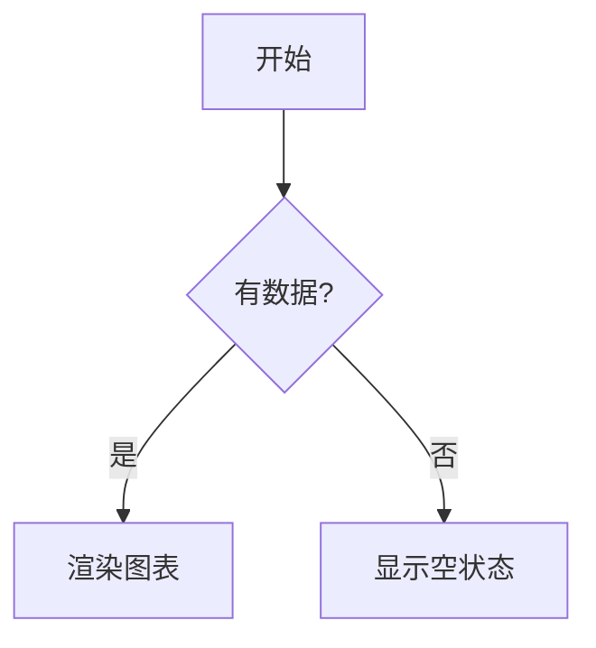

# dsh-mermaid-render

[](https://github.com/topics/dsh)

**DSH 对话 Mermaid 图表渲染插件**：把对话消息里的 `mermaid` / `mmd` 代码块自动渲染成**图表卡片**（预览 / 代码切换），**mermaid 引擎内联打包、完全离线**，不依赖任何 CDN。

## 功能

- **自动渲染**：对话中（assistant 与 user 消息）的 `\`\`\`mermaid` / `\`\`\`mmd` 代码块自动变成图表卡片，无需手动操作。
- **预览 / 代码切换**：卡片右上角可切换「预览」（渲染的 SVG 图）与「代码」（原始 mermaid 源码）。
- **离线可用**：mermaid 引擎（`mermaid.min.js` UMD）在构建时**内联进 client bundle**，页面加载即用，**零 CDN 依赖**——网络被墙/离线环境也能渲染。
- **失败兜底**：渲染失败时保留原始代码块，并在卡片内显示错误横幅（含具体错误信息）。
- **流式兼容**：MutationObserver 跟随消息流式渲染，新出现的 mermaid 块自动处理。
- **主题一致**：卡片样式走 DSH 语义 token（`--dsw-alias-*` / `--dsw-font-*`），深浅主题自适应。

## 工作原理

- **Client 端**（`lib/client.js`）：扫描 `[data-conversation-scroll]` 容器内的 `div.md-code-block`（DSH 内置渲染器与 dsh-think-zh-expand 都产出该结构），检查内部 `code.language-mermaid` / `code.language-mmd` 识别 mermaid 块；命中后隐藏原始 `<pre>`，挂载 React 卡片组件，用内联的 mermaid 引擎渲染 SVG。
- **构建**（`scripts/build.mjs`）：把 `vendor/mermaid.min.js`（3.3MB 自包含 UMD）**base64 编码**注入 `lib/client.src.js` 的占位符，生成 `lib/client.js`（DSH 实际服务的文件）。base64 注入避免 JSON 字符串字面量被压缩源码里的控制字符破坏。
- **Server 端**（`lib/index.js`）：空壳（纯 client 插件，无 host 逻辑）。

## 安装

```sh
dsh plugin --profile web add link:/Users/bsfeng/IdeaProjects/my-dsh-plugins/plugins/dsh-mermaid-render
```

装完后**重启 `dsh web`**（bundle 层在启动时组合），再硬刷新浏览器（Cmd/Ctrl+Shift+R）。

> 与 [dsh-think-zh-expand](../dsh-think-zh-expand/README.md) 配合：该插件替换消息渲染器后仍产出 `md-code-block` 结构，本插件可直接识别渲染。

## 使用

发送包含 mermaid 代码块的消息即可：

````markdown

````

代码块会自动变成图表卡片（右上角可切换 预览 / 代码）。

## 开发

```sh
# 修改 lib/client.src.js 后重新构建（注入 mermaid 引擎）
npm run build

# 运行测试（client 渲染路径 + 扫描逻辑）
npm test
```

> `lib/client.js` 是构建产物，**必须提交**（CI 只跑 `node --check` + 测试，不执行构建）。

## 已知限制

- 卡片为「预览 / 代码」两态，暂无缩放 / 全屏（需要可后续加）。
- mermaid 引擎体积较大（内联后 client.js 约 4.4MB），本地加载可接受；首次解析约 1-2 秒。
