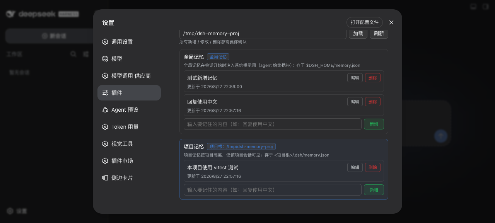

# dsh-my-memory

> DSH（DeepSeek Harness）记忆插件：**全局/项目两级记忆持久化**，全局记忆在会话开始时注入系统提示词（agent 始终携带你的关键偏好），设置页可视化面板管理（新增/修改/删除均需自定义确认 UI 确认），`memory_query` 工具只读查询、`memory_save` 工具经用户确认后保存记忆。纯官方依赖（面板挂在官方设置页扩展点，不依赖第三方插件）。

[](https://www.npmjs.com/package/dsh-my-memory)



## 功能

- **两级记忆**：
  - **全局记忆**（跨项目）：用户偏好、常用习惯——存 `$DSH_HOME/memory.json`；
  - **项目记忆**（按项目 cwd 隔离）：项目约定、技术栈决策——存 `$DSH_HOME/memory/projects/<项目 id>.json`（issue #108：集中 `$DSH_HOME`，项目 id 由项目根路径 sha256 前 12 位确定；按 cwd 向上找 `.git` 定位项目根）。旧版本存于 `<项目根>/.dsh/memory.json` 的既有记忆在首次访问该项目时**自动迁移**到新位置，记忆不丢失。注：dsh-my-skill-manager 的项目配置仍存项目目录（`<项目根>/.dsh/`），与 dsh-my-memory 原模式相同，是否一并集中到 `$DSH_HOME` 另行评估，避免两套模式长期并存。
- **系统提示词注入**：会话开始时把全局记忆注入系统提示词（`ctx.systemPrompt.section`，order -95，persona 之前），agent 始终携带用户关键偏好；注入受条数（`maxItems`，默认 5）与单条长度（`maxDescLength`，默认 200）双重上限，避免提示词膨胀；记忆变更后下一轮组装即时生效，无需重启。
- **可视化面板**：设置 → 插件 → 「记忆」页签（官方 slots 扩展点），**全局/项目分区显示**（项目 section 蓝色 accent + 项目根徽标），支持新增/修改/删除。
- **写操作需用户确认**：所有新增/修改/删除必须经**自定义确认 UI**（基于 ask 改造，不用原生 confirm）——**删除红色醒目 + 二次确认**，**保存/新增绿色确认**；服务端强制 `confirmed: true` 标记，缺失即 400 拒绝，记忆绝不静默变更。
- **工具查询**：`memory_query` 工具（只读）让 agent 查询记忆详情——全局/项目过滤 + 关键词过滤，项目 cwd 取会话工作目录。
- **工具保存**（issue #107）：`memory_save` 工具让 agent 主动保存记忆（`scope`/`desc` 必填、`cwd` 可选）——每次调用都经 **DSH 原生审批确认**（`tools/pre-execute` 返回 `{ kind: 'ask' }`，用户确认后才写入），记忆绝不静默变更；保存后 `memory_query` 立即可查、后续会话注入生效。
- **持久化可靠**：原子写（tmp+rename）+ 防抖（300ms 合并写盘），重启后自动恢复，不丢记忆；项目记忆集中 `$DSH_HOME` 管理（issue #108），旧 `<项目根>/.dsh/memory.json` 数据首次访问自动迁移，项目目录不产生 `.dsh/`。

## 安装

```bash
# npm 安装（推荐）
dsh plugin --profile web add dsh-my-memory --trust-lockfile

# 或从本仓库 link 安装
git clone https://github.com/baosfeng/my-dsh-plugins.git
dsh plugin --profile web add link:<仓库路径>/plugins/dsh-my-memory
```

## 使用

1. 打开 DSH Web 设置 → 插件 → **记忆**；
2. **全局记忆**区块：输入要记住的内容（如「回复使用中文」）→ 绿色「新增」→ 绿色确认面板「确认保存」→ 写入 `$DSH_HOME/memory.json`；条目可「编辑」（绿色保存确认）或「删除」（红色确认面板 + 红色「确认删除」二次确认）；
3. **项目记忆**区块：**面板打开时自动加载当前会话项目的记忆**（issue #104，经 `/my-memory/api/session` 解析会话 cwd，复用 `memory_query` 的会话 cwd 定位逻辑），显示项目记忆（蓝色 accent + 项目根徽标），操作同全局；亦可在顶部输入其他项目根路径 → 「加载」切换查看其他项目记忆；
4. 新会话开始时，全局记忆自动注入系统提示词（agent 可见）；agent 可用 `memory_query` 工具查询记忆详情（含项目记忆），也可用 `memory_save` 工具在**用户确认后**保存记忆——发现值得记住的信息时可请 agent 保存（如「把「用 pnpm 装依赖」记到记忆里」）。

## 配置

```jsonc
// cordis.yml 中 my-memory 的 config 字段
{
  "maxItems": 5, // 注入系统提示词的全局记忆条数上限（默认 5）
  "maxDescLength": 200, // 单条记忆注入长度上限（字符，默认 200）
  "proactivePropose": false, // issue #78 阶段预留：开启后 memory_save 工具描述引导 agent 主动向用户提议保存记忆（默认关，agent 按用户要求保存）
}
```

## 实现要点

- **持久化**：`lib/store.js` 双作用域存储（全局 `$DSH_HOME/memory.json` + 项目 `$DSH_HOME/memory/projects/<项目 id>.json`，issue #108 集中位置，项目 id = 项目根路径 sha256 前 12 位；旧 `<项目根>/.dsh/memory.json` 首次访问自动迁移到新位置并清理旧文件），原子写（tmp+rename）+ 防抖（300ms 合并写盘）+ 启动 `load()` 恢复缓存；写操作 await 恢复完成，避免重启竞态覆盖。
- **系统提示词注入**：`lib/prompt.js` 注册 `dsh-my-memory` section（order -95），text 为 provider 函数——每次组装系统提示词时读取全局记忆缓存，注入最新 `maxItems` 条、每条截断 `maxDescLength` 字符；空记忆渲染空 section（renderPrompt 自动丢弃，零成本）。
- **工具**：`lib/tool.js` 直接构造 ToolDefinition（JSON Schema 参数/输出，不导入 `@deepseek-ai/dsh-tools`——本仓库插件只解析 Node 内置模块与相对路径），`ctx.tools.register` 注册 `memory_query`（只读）与 `memory_save`（写，经 `tools/pre-execute` 确认门触发 DSH 原生审批后执行，绝不静默变更）。
- **写操作 API**：`lib/api-route.js` 的 `POST /my-memory/api/memory` 强制 `confirmed: true` 用户同意标记，缺失即 400；add/update/delete 各自校验（空 desc、未知 id 等）。
- **自定义确认 UI**：`lib/client.js` 内联确认面板（`dmm-confirm`）——删除红色背景 + 红色「确认删除」按钮（二次确认），保存/新增绿色背景 + 绿色「确认保存」按钮；项目 section 蓝色 accent + 项目根徽标与全局区分。

## 开发

```bash
npm run build   # 拼接 lib/parts/*.part.js → lib/client.js
npm test        # vitest（server + client 渲染路径）+ cucumber（Gherkin 验收）
```

## 相关文档

→ [记忆概述](../../docs/记忆/概述.md) · [需求清单](../../docs/记忆/需求清单.md)
