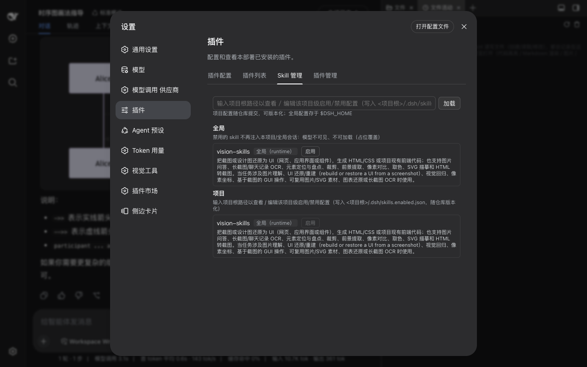

# dsh-skill-manager

> DSH（DeepSeek Harness）Skill 管理插件：分「全局 / 项目」查看 skill 列表，按项目启用/禁用。**禁用的 skill 不再注入该项目会话：模型不可见、不可加载。** 纯官方依赖（面板挂在官方设置页扩展点，不依赖第三方插件）。

[](https://www.npmjs.com/package/dsh-skill-manager)



## 功能

- **Skill 列表（分「全局 / 项目」两维度显示）**：每个 skill 显示名称、描述、来源（`user-dsh` / `user-agents` / `custom` / `bundled` / `project-dsh` / `project-agents`）、状态（启用/已禁用）。
- **按项目启用/禁用**：
  - 全局禁用：所有项目生效（配置存 `$DSH_HOME/skills.enabled.json`）；
  - 项目禁用：仅当前项目生效，**也可在项目内禁用全局 skill**（配置存 `<项目根>/.dsh/skills.enabled.json`，随仓库提交、可版本化）；
  - 禁用的 skill 在合并目录中被「已禁用」占位覆盖（rank-0 provider），模型侧不可见、`get()` 拒绝加载正文。
- **设置页面板**：设置 → 插件 → 「Skill 管理」页签（官方 slots 扩展点，无需 dsh-better-sidebar）。

## 安装

```bash
# npm 安装（推荐）
dsh plugin --profile web add dsh-skill-manager

# 或从本仓库 link 安装
git clone https://github.com/baosfeng/my-dsh-plugins.git
dsh plugin --profile web add link:<仓库路径>/plugins/dsh-skill-manager
```

## 使用

1. 打开 DSH Web 设置 → 插件 → **Skill 管理**；
2. 「全局」区块：切换任意 skill 的全局启用/禁用；
3. 「项目」区块：在顶部输入**项目根路径**后点「加载」，即可切换该项目内的启用/禁用（含全局 skill 的项目内禁用）；
4. 修改即时生效（catalog 自动失效重算），无需重启。

## 配置格式

```jsonc
// <项目根>/.dsh/skills.enabled.json 或 $DSH_HOME/skills.enabled.json
{
  "global": { "disabled": ["some-global-skill"] },
  "project": { "disabled": ["web-search"] }
}
```

- `global.disabled`：全局禁用（所有项目生效）；
- `project.disabled`：当前项目禁用（可禁用项目级与全局级 skill）。

## 实现要点

- **禁用机制**：向 `ctx.skills` 注册 rank-0 占位 provider（全局层）。官方 filesystem provider 的 rank 为 100–500、runtime 为 250，同层合并时 rank 0 占位优先——被禁用名字的真实 skill 不再进入模型目录；`list()` 按会话 `cwd` 解析项目配置，实现「项目覆盖全局」。
- **配置变化即时生效**：保存后调用 `control.invalidate()` 使 skill 目录缓存失效重算。

## 开发

```bash
npm run build   # 拼接 lib/parts/*.part.js → lib/client.js
npm test        # vitest（server + client 渲染路径）
```

## 相关文档

→ [Skill 管理概述](../../docs/Skill管理/概述.md) · [需求清单](../../docs/Skill管理/需求清单.md)
